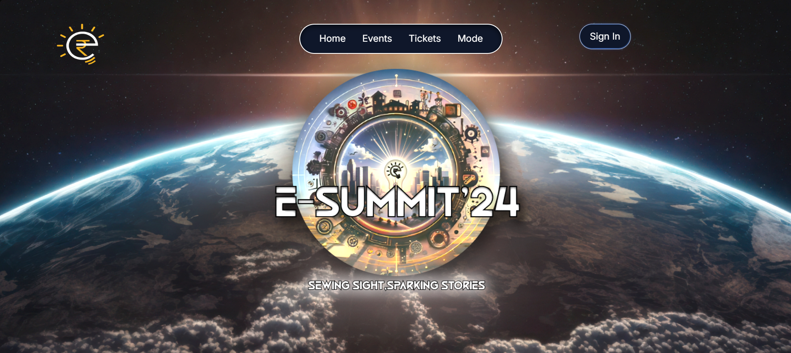
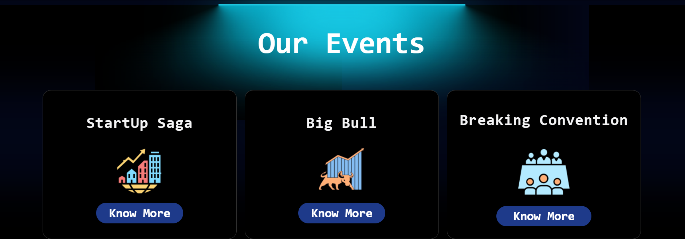
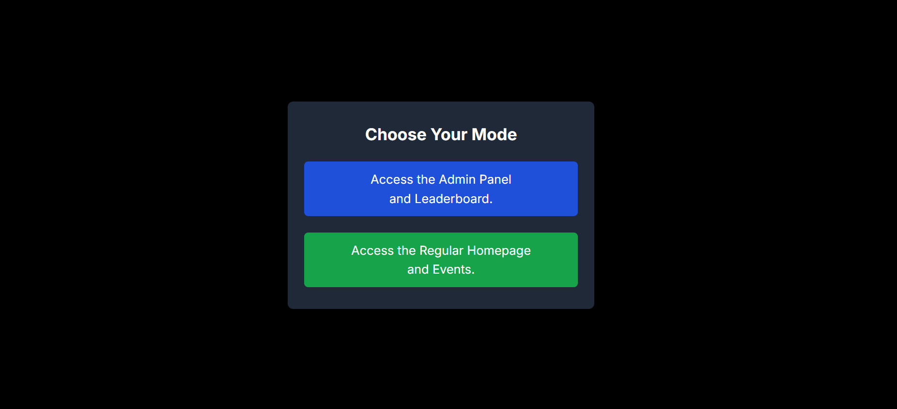
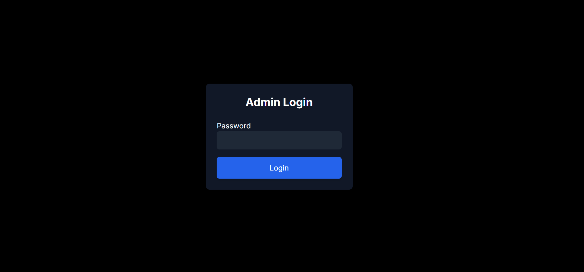
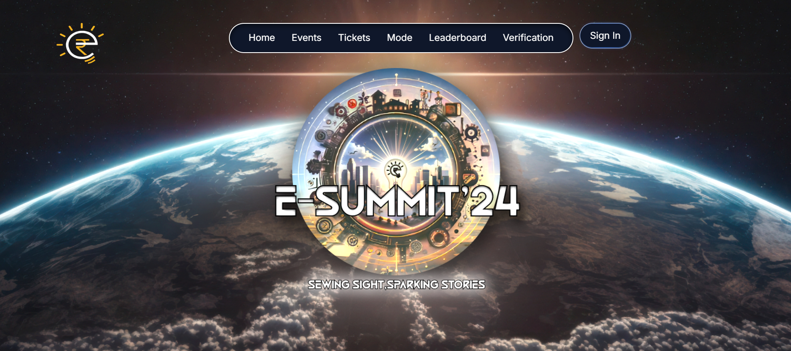
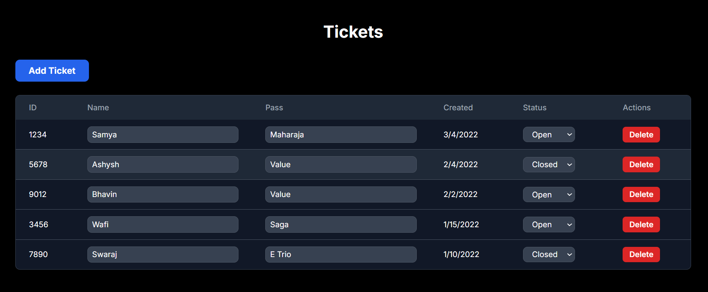

# E-Summit 2024

E-Summit 2024 is a dynamic event website that offers a user-friendly interface for both regular users and administrators. The platform allows users to browse events, purchase tickets, and explore additional features like the leaderboard. Admin users have access to exclusive features like ticket verification and management.

## Features

- **Preloader**: Upon entering the website, a preloader is displayed while the content loads.
- **Role-Based Access Control (RBAC)**: Users can log in as either a regular user or as an admin.
  - **User**: Can view the home page, events, and purchase tickets.
  - **Admin**: Has access to additional features such as the leaderboard and ticket verification/management.
- **Dynamic Navigation**: Depending on the user role, the navigation bar will display different options.
  - **Home**: The main event page.
  - **Events**: A list of upcoming events.
  - **Tickets**: Users can view and purchase tickets.
  - **Mode**: Allows users to switch between user and admin roles.
  - **Leaderboard**: Admin-only feature to view the event leaderboard.
  - **Verification**: Admins can verify tickets, delete, or add tickets manually.


## Installation

1. **Clone the repository**:
   ```bash
   git clone https://github.com/your-username/e-summit-2024.git
   cd e-summit-2024
   ```


## Install dependencies:
```bash
npm install
```
## Run the project:
```bash
npm run dev
```

## Pages & Routes
**Home Page (/):** Displays the main event page with information about events, speakers, and the prize pool.

**Mode Page (/mode):** A page where users can choose to log in as either a regular user or an admin.

 **Leaderboard Page (/leaderboard):** An admin-only page displaying the event leaderboard.

 **Verification Page (/verification):** Admins can view and manage tickets, including the ability to add, delete, or verify tickets.

 **Tickets Page (/payment):** Users can purchase tickets for the event.


## Authentication
**Login Page:** Users can authenticate via a simple login form. By default, users are logged in as regular users.
 To log in as an admin, use the password `admin123` when prompted. This will grant access to additional admin-only features.

## Default Login Credentials (Admin)

Username: admin<br>
Password: admin123

## How to Use

Enter the Website: Upon entering the website, a preloader will be displayed until the site content is fully loaded.

**Navigation Bar:** The Navbar will contain 4 options:

- **Home:** Takes you to the main event page.
- **Events:** Displays a list of upcoming events.
- **Tickets:** Allows users to view and purchase tickets.
- **Mode:** Allows users to switch between admin and user roles.
- **Mode Page:** Clicking on the "Mode" link in the Navbar will take you to a page where you can select your role:

Default: As a user, you can view events and tickets.
Admin Login: To log in as an admin, enter the password "admin123" in the login form.

 Admin users will have access to additional features such as the leaderboard and ticket verification.
Admin Features: Once logged in as an admin:

Leaderboard: Admins can view the leaderboard on the admin homepage.
Ticket Verification: Admins can check, add, or delete tickets in the verification section.






